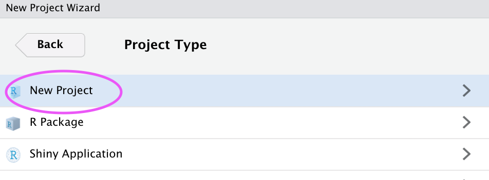
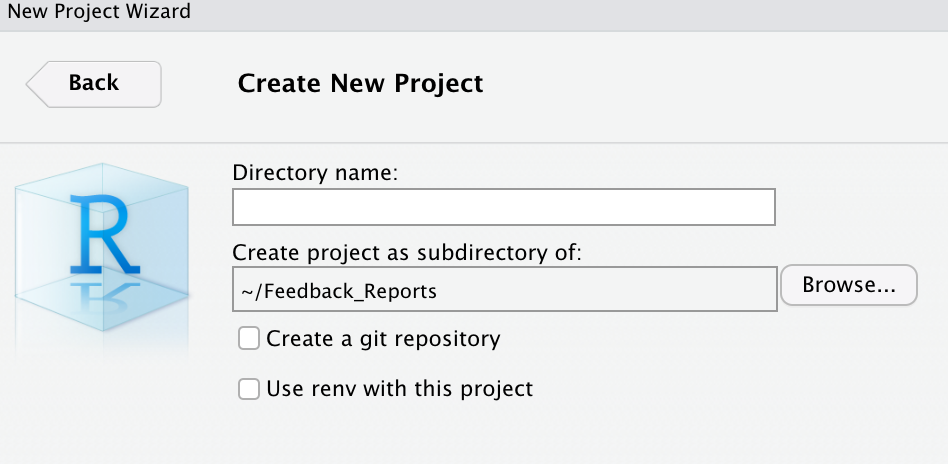

```{r setup, include=FALSE}
options(htmltools.dir.version = FALSE)
library(emo)
library(icons)
```


```{r xaringanExtra, include = FALSE}
xaringanExtra::use_xaringan_extra(c("tile_view", "webcam", "editable", "panelset","scribble", "fit_screen", "clipboard"))
 xaringanExtra::use_search(show_icon = TRUE)
#xaringanExtra::style_share_again(
# share_buttons = c("email", "linkedin", "twitter"),  # Corrected "twiter" to "twitter"
#  foreground = "orange", background = "blue")

#xaringanExtra::use_banner(bottom_center = "yebelay.berehan@c4ed.org")
#xaringanExtra::style_banner(text_color = "red")


```


class: inverse middle

# Outlines

- General introduction to R markdown🐣

- Making presentation slide using xaringan template📝 

- Create presentation using C4ED template 🤹


---

# General introduction to R markdown🐣

## Packages for making presentation in R

1. **`rmarkdown`:** Creates dynamic reports and documents by blending code and text.
2. **`knitr`:** Embeds and executes R code within R Markdown, generating tables and plots.
3. **`tinytex`:** Simplifies LaTeX package management for high-quality documents.
4. **`xaringan`:** Builds interactive web-based presentations using R Markdown.
5. **`xaringanthemer`:** Customizes themes and styles for Xaringan presentations.
6. **`xaringanExtra`:** Enhances Xaringan presentations with features like slide notes and transitions.


```{r, eval=FALSE}
packs <- c(rmarkdown, knitr, tinytex, xaringan, xaringanExtra,
           xaringanthemer)
install.packages("packs")
```

---

# Creating an R project 🐣

- Create a new R Project from within R Studio


---

 - Save in new directory 
.pull-left[

]
.pull-right[

]
 
- Choose the folder where you want to store your R Markdown file




---

- In that new folder, create an R Markdown file
.pull-left[

]
.pull-right[
- File ➡️ New File ➡️ R Markdown ➡️ Click OK
]
-  When you knit, the following happens:


- knit executes the code if there is any, converts the resulting document from `.Rmd (R Markdown)` into `.md (Markdown)`
- pandoc transforms the `.md document` into your preferred output format(s) (e.g., word, pdf, html)
 
---

# The YAML header

YAML includes the metadata variables
- e.g., title, output format    
- written between a pair of three hyphens .blue-h[-]
```{r, eval=FALSE}
---  #<<
title: 
output:
---  #<<
```

--

- Typical **YAML variables** for any output format:

```{r, eval=FALSE}
---
title: 
author: 
date: 
output: 
---
```

---

# YAML &mdash; Variables

- Variables can be provided as strings, options, sub-options, and code

```{r, eval=FALSE}
---
title: "My very funny first slide"
output: 
    pdf_document:
        keep_tex: true
date: "`r Sys.Date()`"      #<<
---
```

- Documents as output formats include

.pull-left[
```{r, eval=FALSE}
---
output: html_document #<< 
output: latex_document #<<  
output: pdf_document #<< 
output: word_document #<< 
---
```  
]
.pull-right[
- HTML
- LaTeX
- PDF
- Word
]


---
 
# Headers

- The number sign <span style="color:red"> # </span> introduces headers; lower levels are created with additional <span style="color:red"> # </span> &mdash; up to total four levels

.pull-left[
```{}
# Introduction
## Introduction
### Introduction
#### Introduction

```
]

.pull-right[

# Introduction
## Introduction
### Introduction
#### Introduction
##### Introduction
]

### Emphases

- A pair of single asterisk .blue-h[&#42;] or underscores .blue-h[&#95;] introduces italics
- <span style="background-color: #228B22; border-radius: 3px; padding: 4px; font-family: 'Source Code Pro', 'Lucida Console', Monaco, monospace;">&#42;italics&#42;</span> or <span style="background-color: #228B22; border-radius: 3px; padding: 4px; font-family: 'Source Code Pro', 'Lucida Console', Monaco, monospace;">&#95;italics&#95;</span> becomes .out-t[*italics*]    
- A pair of double asterisk or underscores introduces bold  
- <span style="background-color: #228B22; border-radius: 3px; padding: 4px; font-family: 'Source Code Pro', 'Lucida Console', Monaco, monospace;">&#42;&#42;bold&#42;&#42;</span> or <span style="background-color: #228B22; border-radius: 3px; padding: 4px; font-family: 'Source Code Pro', 'Lucida Console', Monaco, monospace;">&#95;&#95;bold&#95;&#95;becomes .out-t[**bold**]

---
 
# Equations

Inline equations go between a pair of single dollar signs "$" with no space between the signs and the equation itself

.inline-c[$E = mc^{2}$] becomes .out-t[*E = mc<sup>2</sup>*]

Block equations go in between a pair of double dollar signs 

.inline-c[&#x24;&#x24;E = mc^{2}].inline-c[&#x24;&#x24;] becomes


.out-t[

<center> <i> E = mc<sup>2</sup> </i> </center>

]

.pull-left[
```
$$Y=\beta_0+\beta_1x^2+\epsilon$$
$$\bar{x}=\frac{\sum_{i=1}^n x_i}{n}$$
```
]

.pull-right[
$$Y=\beta_0+\beta_1x+\beta_2x^2+\epsilon$$
$$\bar{x}=\frac{\sum_{i=1}^n x_i}{n}$$
]

---
 
# Lists

Lines starting with asterisk .yellow-h[&#42;] as well as plus .yellow-h[&#43;] or minus .yellow-h[&#8722;] signs introduce lists
.pull-left[
```{r eval=FALSE}
- books
- articles
- reports
```
]
.pull-right[

- books
- articles
- reports
]

- Lists can be numbered, nested within each other, with indentation

.pull-left[
```{r eval=FALSE}
1. books
2. articles
    - published
    - under review
        + revised and resubmitted
    - work in progress
```
]
.pull-right[
1. books
2. articles
   - published
   - under review
      + revised and resubmitted
   - work in progress
]

---
 
.pull-left[### .fancy[Dashes]

- Two hyphens grouped together introduce small dash
  - .inline-c[&#8208;&#8208;] becomes <span style="color:red">.out-t[&ndash;]</span>

- Three hyphens grouped together introduce bbiger dash
  - .inline-c[&#8208;&#8208;&#8208;] becomes <span style="color:red">.out-t[&mdash;]</span>
]

.pull-right[### .fancy[Subscripts and Superscripts]

- underscore (`_`) introduces subscript
  - $ CO_2 $ becomes $CO_2$
- `^` introduces superscript
  - R^2  becomes $R^2$
]

--------------------------------------------------------------------------

---

#  Making presentation slide using xaringan template📝

* Xaringan = shar-in-gen or [ʃæ.ˈriŋ.gæn], which is created by [Yihui Xie](https://yihui.org/) 
* Install the package from GitHub
```{r, eval=FALSE, message=FALSE}
remotes::install_github("yihui/xaringan")
```
* In RStudio: Make a new project
* File ➡️ New File ➡️ R Markdown ➡️ From Template ➡️ Ninja Presentation

- Delete everything but YAML
- Save. (save, save, save!)

---

# Then the YAML page 
.pull-left[

]
.pull-right[
```{r, eval=FALSE}
---
title: "Presentation Ninja"
subtitle: "⚔<br/>with xaringan"
author: "Yihui Xie"
institute: "RStudio, PBC"
date: "2016/12/12(updated:`r Sys.Date()`)"
output:
  xaringan::moon_reader: # output format
nature:
  highlightStyle:  # how the code displays
  highlightLines: true 
countIncrementalSlides: false
#ratio "16:9" # or 4:3
---
```
]
---

- To view the slides generated by your new Rmd file, you have two options:

**Option 1**. Run xaringan's infinite moon reader function in the console `r emo::ji("rocket")` 
```{r eval=FALSE, echo=TRUE}
xaringan::inf_mr()
```

**Option 2**. Knit the document `r emo::ji("yarn")` 


---

# xaringan syntax

.pull-left[

### Familiar from **markdown**

- Headings (#, ##, ###)
- **Bold** and _italic_ type
- Links and images with `[]()` and ``
- Bullet points can be added with 
<br>`-`, `+`, or `*`
- Numbered lists can be created with `1.`
]

--

.pull-right[
### Not so familiar, from **remark.js**
- First slide starts immediately after YAML, doesn't need to begin with three dashes(`---`)
- Slides are separated by three dashes <br>(`---`)
- Incremental slides are separated by two dashes (`--`)
]

---

class: inverse left middle

# How can we make our slides look more interesting?

by adjusting 
- Placement of texts 
- pretty pictures
- and icons

---

# Make slides look more interesting: <span style="color:orange">Align an entire slide</span>

.pull-left[
Horizontally
```r
left,
*center,
right
```
]

.pull-right[
Vertically
```r
top, 
*middle, 
bottom 
```
]

```r
---
*class: center, middle
This content is also centered and in the middle of the slide 
---
```
- Slide with some text aligned
```r
.right[...and finish it on the right.]
```
.right[...and finish it on the right.]

---

# Make slides look more interesting: <span style="color:orange">Placement</span>

- Pull content to either side of the slide

.pull-left[

- **<span style="color:#186F65"> The `.pull-left[]` class pulls content to the left 47%</span>**

```{
.pull-left[

]
```

]

.pull-right[

- <span style="color:blue">And `.pull-right[]` pulls content to the right 47%</span>
```{r
.pull-right[

]
```

]

- They don't have to take up the entire slide. Like for this text, you can decide to continue creating content that isn't pulled to either side.

---

# Make slides look more interesting: <span style="color:orange">two-column layout</span>


.left-column[
**`.left-column[]` places content into a column 20% wide**
- And text is a little lighter
]

--

.right-column[
**`.right-column[]` places content into a column 75% wide**
- It also has a _little_ bit of padding on the top

- And unlike the `.pull` content classes, these column classes are fixed for the entire slide
- They are meant to be used together

.center.small-image[

]
]

---
class: inverse left middle

# How to add images to your slides pictures

- Insert image from local or external sources 

- Integrate R plots to the slide

---
class: inverse left top

# insert image from local or external sources

- There are a variety of ways to add images to your slides!

.panelset[
.panel[.panel-name[Markdown]

.pull-left[

```r

```

- simple
- not very flexible
- output size fully dependent on the size of the image, but scaling can be manage
]

.pull-right[
]

] <!---->

.panel[.panel-name[knitr]

.pull-left[

```{r, eval=F, echo=TRUE}

```
- pretty flexible
- a little bulky
]

.pull-right[
```{r, echo=FALSE, out.width="100%"}

```
]
] <!---->

.panel[.panel-name[HTML]
.pull-left[
```{html, eval=FALSE, echo=TRUE}

```
- most flexible
- a bit unsightly
- takes time to [get used to syntax](https://www.w3schools.com/html/html_images.asp)
]
.pull-right[

]
]

]<!---->

---
background-image: url("img/fullimage.png")
background-size: 100%

class: middle left

# Full background image


- <span style="color:white">For example I use the this code for this background image.</span>


```
background-image: url("img/fullimage.png")
background-size: cover
```

- <span style="color:red">`background-size: cover`</span> <span style="color:white"> --> will cover the slide so that there is no white space.</span>
- <span style="color:red">`background-position:`</span> <span style="color:white"> play with [this](https://www.w3schools.com/cssref/pr_background-position.asp)</span>


---

# visualize our data using r code 

.panelset[

.panel[.panel-name[plot]

```{r, fig.showtext = TRUE,fig.align='center', echo=FALSE, warning=FALSE, message=FALSE, fig.width= 10, fig.height=6}
library(ggplot2)
library(palmerpenguins)
   ggplot(penguins, aes(x = flipper_length_mm, y = body_mass_g, color = sex)) +  geom_point() + theme_bw()+
  scale_color_manual(values = c("darkorange", "cyan4"), na.translate = FALSE) +
  labs(title = "Penguin flipper and body mass") +
  labs(x = "Flipper length (mm)", y = "Body mass (g)",
       color = "Penguin sex")  #  facet_wrap(~ species) 
```

]

.panel[.panel-name[R code]

```{r, fig.showtext = TRUE,fig.align='center', eval=FALSE, warning=FALSE, message=FALSE, fig.width=6, fig.height=4}

library(ggplot2)
library(palmerpenguins)
   ggplot(penguins, aes(x = flipper_length_mm, y = body_mass_g, color = sex)) +  
   geom_point() + theme_bw()+
  scale_color_manual(values = c("darkorange", "cyan4"), na.translate = FALSE) +
  labs(title = "Penguin flipper and body mass") +
  labs(x = "Flipper length (mm)",  y = "Body mass (g)",
       color = "Penguin sex")  #  facet_wrap(~ species) 
```

]
.panel[.panel-name[Chunk Code]

]
.panel[.panel-name[Map]
```{r, warning=FALSE, message=FALSE}
library(leaflet)
leaflet() %>% addTiles() %>% setView(lng = 40.489673, lat = 9.1450, zoom = 3)
```
]

.panel[.panel-name[Interactive plot1]

```{r, fig.showtext = TRUE,fig.align='center', echo=FALSE, warning=FALSE, message=FALSE, fig.width= 10, fig.height=6}
library(plotly);library(ggplot2)
library(palmerpenguins)
plot <- ggplot(penguins, aes(x = flipper_length_mm, y = body_mass_g, color = sex)) +  geom_point() + theme_bw()+
  scale_color_manual(values = c("darkorange", "cyan4"), na.translate = FALSE) +
  labs(title = "Penguin flipper and body mass") +
  labs(x = "Flipper length (mm)", y = "Body mass (g)",
       color = "Penguin sex")  #  facet_wrap(~ species) 
ggplotly(plot)
```

]
.panel[.panel-name[Interactive plot2]

```{r, echo=FALSE,fig.align='center', echo=FALSE, warning=FALSE, message=FALSE, fig.width= 10, fig.height=5}
library(plotly)
library(dplyr)
set.seed(123)
df <- diamonds[sample(1:nrow(diamonds), size = 1000),]
df.summ <- df %>% group_by(cut) %>% summarize(Mean = mean(table), Min = min(table), Max = max(table))
p <- ggplot(df.summ, aes(x = cut, y = Mean, ymin = Min, ymax = Max, fill = cut)) +  geom_bar(stat = "identity") + 
  geom_errorbar() + 
  ggtitle("Bar chart with Error Bars")

ggplotly(p)
```
]
]

---

class: inverse left top

# Create presentation using C4ED template 🤹

.panelset[

.panel[.panel-name[New Rmd File]
.pull-left[
1. New File
2. New R Markdown

]

.pull-right[
3\. From Template 


]
]<!---->

.panel[.panel-name[Directory]

The new directory in the "Files" pane contains
.left[
+ `r fontawesome::fa("file-code")` the new Rmd file (i.e. <span style="color:orange">`Xaringan Slide.Rmd`</span>)

+ `r fontawesome::fa("folder-open")` the <span style="color:orange">`img`</span> folder containing logo files

+ `r fontawesome::fa("folder-open")` the <span style="color:orange">`css`</span> folder containing the custom <span style="color:orange">`C4ED`</span> theme files and an HTML file in charge of adding the c4ed logo to each slide.
]
] 

.panel[.panel-name[YAML 1]
```{r, eval=FALSE, echo=TRUE}
---
title: "Making a Presentation in R Using c4ed theme: Xaringan"
subtitle: "Center for Evaluation and Devlopment(C4ED) Using c4ed theme" 
#institution: " " 
author: "Yebelay Berehan"
date: "`r stringr::str_replace(format(Sys.time(), '%B %d, %Y'), '^0','')`"
output: 
  xaringan::moon_reader:
    css:
      - default
      - c4ed_theme.css
      - css/fonts_c4ed.css
```
] 

.panel[.panel-name[YAML 2]
More options for output <span style="color:red">`xaringan::moon_reader`</span>
```{r, eval=FALSE, echo=TRUE}
    nature: 
      highlightStyle: github   # highlighting syntax for code
      highlightLines: true     # true: enables code line highlighting
      countIncrementalSlides: false # incremet not counted as page
      highlightLanguage: ["r"]       # languages to highlight
      countdown: 60000  # add time count for each slide
      ratio: "16:10" # or 16:9  # size of slide
    includes:
      after_body: [css/insert-logo.html]   # include logos to each page
---
```
] <!---->

.panel[.panel-name[c4ed1]
.pull-left[
```{}
.remark-slide-content {
  background-color: #FFFFFF;
  border-top: 70px solid #006D6B;
  font-size: 24px;
  font-weight: 200;
  line-height: 1.5;
  padding: 1em 2em 1em 2em;
}
.title-slide {
  background-image: url(img/logo-title-slide.png), 
  url(img/fig.png);
  background-size: 200px auto, 100% 200px;
  background-position: 90% 5%, bottom;
  background-repeat: no-repeat;
}

```

]
.pull-right[
```{}
/* colored to white for slides that have both
   the .title-slide and .inverse classes.*/
.title-slide .inverse .remark-slide-content {

  background-color: #ffffff;
  color: #ffffff; /* Set the text color to white */
}
/*--Make color the inverse slide -- */
.inverse {
  background-color: #006D6B;
  text-shadow: none;
}

```
]
] 

.panel[.panel-name[c4ed2]

- The customized CSS to c4ed theme is found in the following link
[c4ed_theme.css](https://github.com/Yebelay/Making-Slide-in-R/blob/main/c4ed_theme.css)

] 
] 

---


# Table
```{r, warning=FALSE, message=FALSE}
library(DT) # Create an interactive data table

datatable(iris, options = list(pageLength = 10))
```

---

# Keyboard shortcuts

.pull-left[
- **<span style="color:orange">k</span>**	 **<span style="color:#006D6B"> Go to previous slide</span>**

- **<span style="color:orange">j</span>**	**<span style="color:#006D6B">Go to next slide</span>**

- **<span style="color:orange">b</span>** **<span style="color:#006D6B">Toggle blackout</span>**

- **<span style="color:orange">m</span>** **<span style="color:#006D6B">Toggle mirrored </span>**

- **<span style="color:orange">f</span>**	**<span style="color:#006D6B">Toggle fullscreen mode</span>**

- **<span style="color:orange">c</span>**	**<span style="color:#006D6B">Clone slideshow</span>**
]

.pull-right[
- **<span style="color:orange">p</span>**	**<span style="color:#006D6B">Toggle presenter mode</span>**

- **<span style="color:orange">t</span>**	**<span style="color:#006D6B">Restart the presentation timer</span>**

- **<span style="color:orange">?, h</span>**	**<span style="color:#006D6B">Toggle this help</span>**

- **<span style="color:orange">o</span>**	**<span style="color:#006D6B">Tile View: Overview of Slides</span>**

- **<span style="color:red">f</span>**	**<span style="color:#006D6B">Fit Slides to Screen</span>**

- **<span style="color:red">s</span>**	**<span style="color:#006D6B">Toggle scribble toolbox</span>**

- **<span style="color:red">w</span>** **<span style="color:#006D6B">open webcam </span>**
]

---

class: inverse

background-image: url("img/thank you.jpg")
background-size: cover


```{r, echo=FALSE, eval=FALSE}
library(renderthis)
to_pptx(from = "Slide.html",
  complex_slides = TRUE,
  delay = 1,
  keep_intermediates = TRUE)
```

```{r, echo=FALSE, eval=FALSE}
library(renderthis)
to_pdf( "Slide.html",
  complex_slides = TRUE,
  delay = 1,
  keep_intermediates = TRUE)
```


```{r share-again, echo=FALSE}
xaringanExtra::use_share_again()
```

```{r style-share-again, echo=FALSE}
xaringanExtra::style_share_again(
  share_buttons = c("twitter", "linkedin", "email")
)
```


